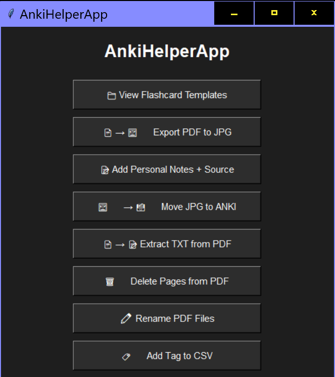
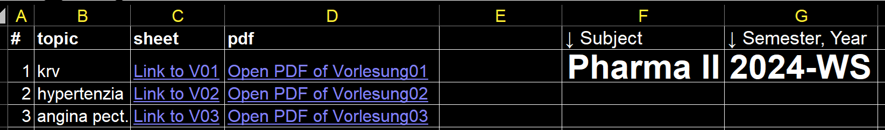
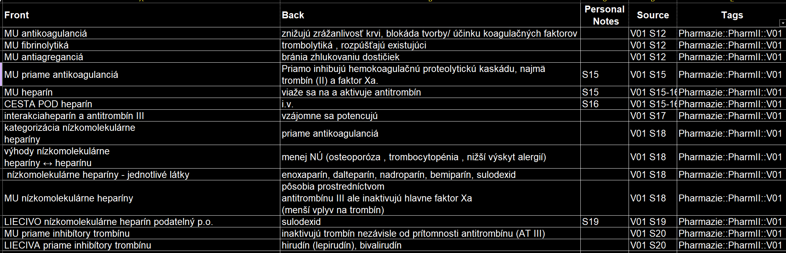

<h3 align="center">ANKI Lectures Management</h3>

  

<!-- TABLE OF CONTENTS -->

  
Table of Contents

  <ol>
    <li><a href="#getting-started">Getting Started</a></li>
    <ul>
      <li><a href="#prerequisites">Prerequisites</a></li>
    </ul>
    <li><a href="#usage">Usage</a></li>
    <li><a href="#roadmap">Roadmap</a></li>
    <li><a href="#additional-notes">Additional Notes</a></li>
    <li><a href="#contact">Contact</a></li>
  </ol>

<!-- ABOUT THE PROJECT -->
## About The Project

ANKI Lectures Management is a semi-automated tool designed to automate the management of exporting lecture materials and notes from lectures/books (as pdf) to ANKI as follows:

LECTURE/BOOK (pdf) >> Flashcards in Excel (csv), JPG from PDF >> ANKI 

The app includes functionalities to streamline the following tasks:

- [1] Opening an Excel-template for creating flashcards.
- [2] Exporting lecture/book slides to JPG to be used on flashcards.
- [3] Semi-automating the process of adding personal notes as HTML crosslink.
- [4] Moving exported JPG files to the ANKI pictures directory (being cross-linked as HTML).

### Pipeline

The pipeline is an upgrated mix of following ideas with some tweeks:

- ANKING NOTETYPE
- CSV as input to ANKI
- HTML links of pictures located in ANKI Folder instead of copy/paste 

### Tweeks

- Excel to be used as general manager for notes with crosslinks in sheets and to lectures in pdf:

  

- Each topic on new sheet reachable from main sheet via crosslink, ennumerated and named, can be filter within one sheet with all notes

  

(<a href="#additional-notes">for detailed references, Additional Notes</a>)

(<a href="#readme-top">back to top</a>)

<!-- GETTING STARTED -->
## Getting Started

(<a href="#readme-top">back to top</a>)

### Prerequisites
The Excel ANKI-Template is created for ANKING Notetype, otherwise adapt only for Basic type. 

(<a href="#readme-top">back to top</a>)

<!-- USAGE EXAMPLES -->
## Usage

### Python app
Launch app *1_AnkiHelperApp.py*

Upon launching the app, you can choose from the following options:

- [1] View Flashcards Template (anki_template.csv)
      Opens the ANKI flashcards template in Excel for viewing and editing.
      
- [2] Export Lecture/Book to JPG (pdf_to_jpg.py)
  
      Converts lecture/book slides from a PDF file to JPEG images for ANKI review. The user is promted to write a name and number of Vorlesung/Praktikum
  
      -based on these logical names:
  
      subject_name_V/P_##_S_##
  
      (V/P - Vorlesung/Praktikum; S - Slide; ## - 01,02,10)
  
      e.g. O-CHEM1_V_01_S02
      
- [3] Add Personal Notes and Source/Missed Questions (for cloze) as HTML

      Processes ANKI template data to add HTML image tags when Personal Notes and Source/Missed Questions information is missing.
      
- [4] Move Exported JPG to ANKI Pictures Directory and Link as HTML

      Moves the exported JPG files to the ANKI pictures directory and creates HTML links for ANKI cards.
  
- [5] Extract TXT from PDF

      As Copy/Pasting from PDF is ofter problematic, TXT can be extracted from given PDF
  
- [6] Delete pages from PDF

- [7] Rename PDF files

- [8] Add tag to csv
  
        Adds tag based on input to column 'Tags' - where cells are empty
        Ensures this does not need to be done manually in Excel

  
### Excel 

In Excel, following functions can be used: 

- [1] Hyperlinks to sheets with lectures
  
*=HYPERLINK("#'name_of_sheet'!A1", "text_to_see")*

e.g. *=HYPERLINK("#'V01'!A1", "Click to see Vorlesung01")* 

Here keyboard shortcut *Ctrl + PgUp/PgDn* recommended for moving in sheets

- [2] Hyperlinks to pdf of lecture from location
- 
*=HYPERLINK("location_of_pdf", "text_to_see")*

e.g. *=HYPERLINK("C:\Users\User1\Desktop\ANKI\Lecture01.pdf", "Open Lecture01")*

(<a href="#roadmap">for detailed steps, see roadmap</a>)

(<a href="#readme-top">back to top</a>)

From the template, only sheet called *3 ANKI ALL-LECTURES* to be exported to csv (UTF-8), all sheets, i.e. ANKI notes, are to be copy/pasted here 

(for future, event. as VBA macro selecting all values in all sheets but 1-3; here is the challenge the variability though)

<!-- ROADMAP -->
## Roadmap

1. **Prepare the Input CSV File:**
   - Ensure your ANKI template file is named `anki_template.csv`.
   - Place `anki_template.csv` in the same directory as the script.
   - Manually edit `anki_template.csv` as needed.
   
2. **Run the Script:**
   - Execute the chosen script.

3. **Output:**
   - Depending on your selection:
     - [1] ANKI flashcards template viewed and edited in Excel.
     - [2] Lecture slides exported to JPEG images.
     - [3] Personal notes added to ANKI cards in HTML format.
     - [4] JPG files moved to the ANKI pictures directory and linked as HTML for ANKI cards.

(<a href="#readme-top">back to top</a>)

<!-- ADDITIONAL NOTES -->
## Additional Notes

(<a href="#readme-top">back to top</a>)

[1] Add JPEGs to ANKI Pictures Folder:
- Move the exported JPEG files to the ANKI pictures directory where they are stored. This folder path is also pinned by Quick access:
  Paste to this folder (path): `C:\Users\timon\AppData\Roaming\Anki2\1. Timon - Pharmazeutische Fakultät\collection.media`

[2] Adapt the CSV File for HTML Crosslinks:
- In Excel Personal Notes and/or Source/Missed Questions (for cloze) transformation will specifie both:
  a) Jpeg crosslink
  b) width=450

The lecture/book slide is to be written as 1,2,10,99,999 to columns under Personal Notes and/or Source/Missed Questions

Sources for the idea (mixed ANKING notetype + input as CSV w/ HTML links):

[1]  **The AnKing Note Types and Add-on** *https://www.youtube.com/watch?v=NYUhNMyAZNs*

[2]  **Importing Flashcards Into Anki** *[[https://www.youtube.com/watch?v=s0QQJp8HPd0](https://www.youtube.com/watch?v=s0QQJp8HPd0)](https://www.youtube.com/watch?v=DIkynwCHLfA)*

[3] **Stop copying and pasting images into your flashcards.** *https://www.youtube.com/watch?v=s0QQJp8HPd0*

<!-- CONTACT -->
## Contact

Timon Nemeth - timon.nemeth@gmail.com

Project Link: [https://github.com/AnkiMonkey/ANKI-Lectures-Management](https://github.com/AnkiMonkey/AnkiHelperApp)
