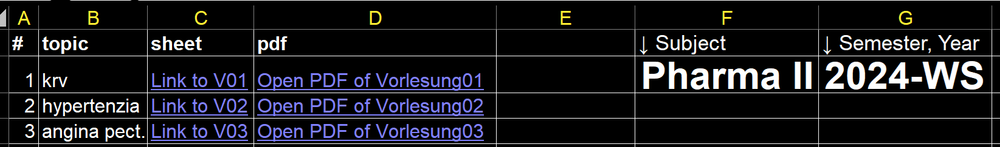
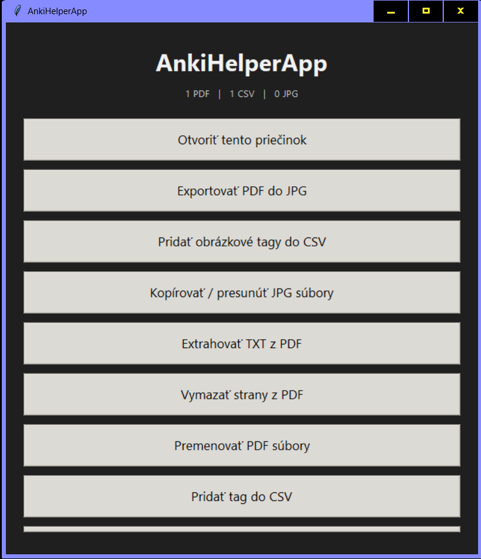
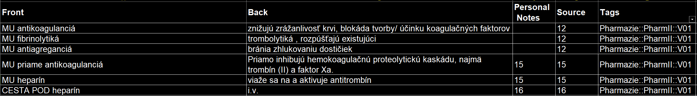

<a id="readme-top"></a>

<h3 align="center">Správa prednášok pre ANKI</h3>

<!-- TABLE OF CONTENTS -->
<details>
  <summary>Obsah</summary>
  <ol>
    <li><a href="#about-the-project">O projekte</a></li>
    <ul>
      <li><a href="#prerequisites">Požiadavky</a></li>
    </ul>
    <li><a href="#usage">Použitie</a></li>
    <li><a href="#roadmap">Postup</a></li>
    <li><a href="#additional-notes">Ďalšie poznámky</a></li>
    <li><a href="#contact">Kontakt</a></li>
  </ol>
</details>

<!-- ABOUT THE PROJECT -->
## O projekte

Tento nástroj zjednodušuje prípravu prednášok, cvičení a knižných materiálov do ANKI. Pomáha spracovať PDF a CSV súbory tak, aby sa dali rýchlejšie použiť pri tvorbe ANKI kariet.

Základná pipeline:

PDF / CSV v priečinku aplikácie → JPG obrázky / upravené CSV / TXT / upravené PDF → ANKI

Aplikácia obsahuje funkcie na zjednodušenie týchto úloh:

- [1] Otvorenie priečinka s aplikáciou.
- [2] Export PDF strán do JPG obrázkov.
- [3] Pridanie HTML tagov pre obrázky do CSV.
- [4] Kopírovanie alebo presun JPG súborov.
- [5] Extrakcia TXT textu z PDF.
- [6] Vymazanie vybraných strán z PDF.
- [7] Premenovanie PDF súborov.
- [8] Pridanie tagu do CSV.
- [9] Oprava stĺpca Back pre ANKI import.

### Riešenie

Celý workflow je postavený na jednoduchej myšlienke:

- prednášky a cvičenia sú uložené ako PDF,
- PDF sa rozdelí na obrázky,
- v Exceli alebo CSV sa určia čísla strán,
- aplikácia vytvorí HTML odkazy na obrázky,
- CSV sa importuje do ANKI.

Používa sa najmä:

- ANKING notetype,
- CSV import do ANKI,
- HTML odkazy na obrázky uložené v ANKI media priečinku,
- Excel ako hlavný manažér poznámok.

### Vylepšenia

Excel slúži ako hlavný prehľad prednášok a poznámok. V jednom súbore sa dajú držať odkazy na prednášky, jednotlivé témy, tagy a výstupy pre ANKI.

<p align="center">
  
</p>

Každá téma môže mať vlastný list. Z hlavného listu sa dá prekliknúť priamo na konkrétnu prednášku alebo tému. Tagy sa dajú filtrovať a pripraviť na export do ANKI.

<p align="center">
  
</p>

<p align="left">(<a href="#additional-notes">podrobnejšie informácie v časti Ďalšie poznámky</a>)</p>

<p align="left">(<a href="#readme-top">späť na začiatok</a>)</p>

<!-- GETTING STARTED -->
## Začíname

<p align="left">(<a href="#readme-top">späť na začiatok</a>)</p>

### Požiadavky

Potrebujete:

- Python,
- Excel alebo iný tabuľkový editor,
- ANKI,
- ANKING notetype,
- PDF súbory s prednáškami alebo cvičeniami,
- CSV súbor pripravený na import do ANKI.

Excelová šablóna je pripravená hlavne pre ANKING notetype. Ak používate základný typ kariet Basic, treba si prispôsobiť stĺpce podľa vlastnej šablóny.

Tu je vzor, ako má vyzerať príprava dát v Exceli:

<p align="center">
  
</p>

Do príslušných stĺpcov sa zapisujú čísla strán alebo slajdov. Aplikácia z nich potom vytvorí HTML odkazy na obrázky pre ANKI.

<p align="left">(<a href="#readme-top">späť na začiatok</a>)</p>

<!-- USAGE EXAMPLES -->
## Použitie

### Python aplikácia

Spustite GUI aplikáciu:

```bash
python anki_gui.py
```

Staršiu konzolovú verziu `anki_app.exe` môžete ponechať lokálne vo svojom počítači, ale hlavné rozhranie je súbor `anki_gui.py`.

Po spustení GUI si môžete vybrať jednu z týchto možností:

### [1] Otvoriť tento priečinok

Otvorí priečinok, v ktorom je aplikácia. Do tohto priečinka vložte PDF a CSV súbory, s ktorými chcete pracovať.

### [2] Exportovať PDF do JPG

Konvertuje stránky PDF do JPG obrázkov pre ANKI.

Pri prednáške alebo cvičení sa aplikácia opýta na:

- názov predmetu,
- typ materiálu,
- číslo prednášky alebo cvičenia.

Názvy súborov sa generujú podľa logiky:

```text
subject_name_C/P_##_S_##
```

Vysvetlenie:

- `C` = cvičenie,
- `P` = prednáška,
- `S` = strana alebo slajd,
- `##` = číslo vo formáte 01, 02, 10.

Príklady:

```text
O-CHEM1_C_01_S_02
O-CHEM1_P_01_S_02
```

Pre knihu sa používa formát:

```text
KNIHA_nazovknihy_S_##
```

### [3] Pridať obrázkové tagy do CSV

Spracuje CSV súbor a pridá HTML tagy pre obrázky do vybraných stĺpcov.

Podporované stĺpce:

- Source,
- Personal Notes,
- Extra,
- Missed Questions.

Príklad výsledného HTML odkazu:

```html

```

### [4] Kopírovať alebo presunúť JPG súbory

Skopíruje alebo presunie exportované JPG obrázky do cieľového priečinka.

Pre ANKI vyberte priečinok:

```text
collection.media
```

### [5] Extrahovať TXT z PDF

Extrahuje text z vybraného PDF súboru do TXT súboru.

Toto je užitočné, keď chcete z prednášky rýchlo získať text a ďalej ho upravovať.

### [6] Vymazať strany z PDF

Vytvorí nový PDF súbor bez vybraných strán.

Príklad vstupu:

```text
1,3,5-7
```

Tým sa odstránia strany 1, 3, 5, 6 a 7.

### [7] Premenovať PDF súbory

Premenuje vybrané PDF súbory v priečinku aplikácie.

### [8] Pridať tag do CSV

Pridá zadaný tag do stĺpca Tags. Tag sa pridá iba tam, kde je bunka prázdna.

### [9] Opraviť stĺpec Back

Opraví formátovanie poľa Back pre ANKI HTML import.

Toto je užitočné najmä vtedy, keď má byť viacero častí odpovede na samostatných riadkoch.

---

## Excel

V Exceli môžete používať hypertextové odkazy na rýchly pohyb medzi listami a PDF súbormi.

### [1] Odkaz na iný list v Exceli

```excel
=HYPERLINK("#'nazov_listu'!A1", "text_na_zobrazenie")
```

Príklad:

```excel
=HYPERLINK("#'P01'!A1", "Klikni pre Prednáška 01")
```

Na presun medzi listami môžete používať:

```text
Ctrl + PgUp
Ctrl + PgDn
```

### [2] Odkaz na PDF prednášku

```excel
=HYPERLINK("cesta_k_pdf", "text_na_zobrazenie")
```

Príklad:

```excel
=HYPERLINK("C:\Users\User1\Desktop\ANKI\Lecture01.pdf", "Otvoriť Lecture01")
```

<p align="left">(<a href="#roadmap">podrobnejšie kroky v časti Postup</a>)</p>

<p align="left">(<a href="#readme-top">späť na začiatok</a>)</p>

Zo šablóny treba exportovať iba list:

```text
3 ANKI ALL-LECTURES
```

Exportujte ho ako CSV v kódovaní UTF-8. Všetky listy s ANKI poznámkami sa pred exportom skopírujú do tohto jedného výstupného listu.

<!-- ROADMAP -->
## Postup

<a id="roadmap"></a>

1. **Pripravte vstupné súbory**

   - Vložte PDF a CSV do rovnakého priečinka ako `anki_gui.py`.
   - Exportujte CSV z Excelu v kódovaní UTF-8.
   - Do CSV stĺpcov, ktoré majú obsahovať obrázky, napíšte čísla strán alebo slajdov.

2. **Spustite GUI**

   - Spustite `anki_gui.py` pomocou Pythonu.
   - Vyberte požadovanú funkciu v hlavnom okne.

3. **Spracujte súbory**

   Podľa výberu aplikácia:

   - otvorí pracovný priečinok,
   - exportuje PDF stránky do JPG obrázkov,
   - pridá HTML tagy do CSV,
   - presunie JPG súbory do ANKI media priečinka,
   - extrahuje TXT z PDF,
   - vymaže vybrané strany z PDF,
   - premenuje PDF súbory,
   - pridá tagy do CSV,
   - opraví formátovanie stĺpca Back.

4. **Importujte CSV do ANKI**

   - Otvorte ANKI.
   - Vyberte import CSV súboru.
   - Skontrolujte mapovanie stĺpcov.
   - Zapnite HTML import, ak používate obrázkové tagy.
   - Importujte karty.

<p align="left">(<a href="#readme-top">späť na začiatok</a>)</p>

<!-- ADDITIONAL NOTES -->
## Ďalšie poznámky

<a id="additional-notes"></a>

### Príprava CSV pre HTML odkazy

V Exceli sa do stĺpcov ako Personal Notes, Source alebo Missed Questions zapisujú čísla strán.

Príklad:

```text
1,2,10,99
```

Aplikácia z týchto čísel vytvorí HTML odkazy na obrázky.

Príklad:

```html


```

### Odporúčaná logika práce

1. PDF prednášku vložiť do priečinka aplikácie.
2. Exportovať PDF do JPG.
3. V Exceli pripraviť čísla strán ku kartám.
4. Exportovať Excel list do CSV UTF-8.
5. Spustiť funkciu na pridanie obrázkových tagov.
6. JPG súbory presunúť do `collection.media`.
7. CSV importovať do ANKI.

### Zdroje inšpirácie

Kombinácia ANKING notetype, CSV importu a HTML odkazov na obrázky:

[1] **The AnKing Note Types and Add-on**  
https://www.youtube.com/watch?v=NYUhNMyAZNs

[2] **Importing Flashcards Into Anki**  
https://www.youtube.com/watch?v=s0QQJp8HPd0

[3] **Stop copying and pasting images into your flashcards**  
https://www.youtube.com/watch?v=s0QQJp8HPd0

<p align="left">(<a href="#readme-top">späť na začiatok</a>)</p>

<!-- CONTACT -->
## Kontakt

Pre otázky otvorte GitHub Issue v tomto repozitári.
