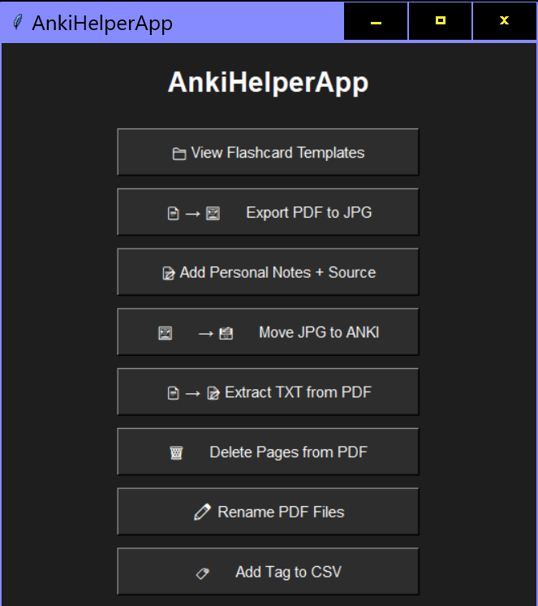

<h3 align="center">ANKI Lectures Management</h3>

  

<!-- TABLE OF CONTENTS -->

  
Table of Contents

  <ol>
    <li><a href="#getting-started">Getting Started</a></li>
    <ul>
      <li><a href="#prerequisites">Prerequisites</a></li>
    </ul>
    <li><a href="#usage">Usage</a></li>
    <li><a href="#roadmap">Roadmap</a></li>
    <li><a href="#additional-notes">Additional Notes</a></li>
    <li><a href="#contact">Contact</a></li>
  </ol>

<!-- ABOUT THE PROJECT -->
## About The Project

ANKI Lectures Management is a semi-automated tool designed to help prepare lecture, practical, and book material for ANKI.

The current version works from one folder:

PDF / CSV files in `new_anki` >> JPG images / edited CSV / TXT / modified PDF >> ANKI

The app includes functionalities to streamline the following tasks:

- [1] Open this folder.
- [2] Export PDF to JPG.
- [3] Add image tags to CSV.
- [4] Copy / move JPG files.
- [5] Extract TXT from PDF.
- [6] Delete pages from PDF.
- [7] Rename PDF files.
- [8] Add tag to CSV.
- [9] Fix Back column.

### Pipeline

The pipeline is an upgraded mix of the following ideas with some tweaks:

- ANKING NOTETYPE
- CSV as input to ANKI
- HTML links to pictures located in the ANKI media folder instead of copy/paste

### Tweaks

- Excel can be used as a general manager for notes with crosslinks in sheets and to lectures in PDF:

  

- Each topic can be placed on a new sheet, reachable from a main sheet via crosslink, enumerated and named. Tags can be filtered within one sheet, so notes for every topic can be found there.

  

(<a href="#additional-notes">for detailed references, Additional Notes</a>)

(<a href="#readme-top">back to top</a>)

<!-- GETTING STARTED -->
## Getting Started

(<a href="#readme-top">back to top</a>)

### Prerequisites

The Excel ANKI template is created for ANKING Notetype. For Basic type, adapt the CSV columns as needed.

Put the files you want to process in the same folder as the app:

- `anki_app.exe`
- `anki_gui.py`
- your `.pdf` files
- your `.csv` files

The app does not use hardcoded project folders. It reads and writes files in its own folder.

(<a href="#readme-top">back to top</a>)

<!-- USAGE EXAMPLES -->
## Usage

### Python app

There are two versions:

- `anki_app.exe` - console menu version
- `anki_gui.py` - graphical button version, run with Python

The existing `anki_app.exe` can still be used. The GUI version is separate.

Upon launching the app, you can choose from the following options:

- [1] Export PDF to JPG

      Converts PDF pages to JPEG images for ANKI review.

      For lecture/practical material, the app now asks for:

      - Cvicenie
      - Prednaska

      The filename logic is:

      subject_name_C/P_##_S_##

      C/P:
      - C = Cvicenie
      - P = Prednaska

      S = slide/page
      ## = 01, 02, 10...

      Example:

      O-CHEM1_C_01_S_02.jpg
      O-CHEM1_P_01_S_02.jpg

      For book material, the filename logic is:

      BOOK_bookname_S_##

- [2] Add Image Tags to CSV

      Processes CSV data and adds ANKI HTML image tags to selected columns.

      Supported columns:

      - Source
      - Personal Notes
      - Extra
      - Missed Questions

      If a selected cell contains a page number, the app changes it to an HTML image tag.

- [3] Copy / Move JPG Files

      Copies or moves exported JPG files to a destination folder.

      For ANKI, choose the ANKI `collection.media` folder as the destination.

- [4] Extract TXT from PDF

      Extracts text from a selected PDF into a `.txt` file.

- [5] Delete Pages from PDF

      Creates a new modified PDF with selected pages removed.

      Example inputs:

      1
      1,3,5
      1-5
      1,3,5-7

- [6] Rename PDF Files

      Renames selected PDF files in the app folder.

- [7] Add Tag to CSV

      Adds the desired tag to the `Tags` column only where cells are empty.

- [8] Fix Back Column

      Fixes `Back` field formatting for ANKI HTML import.

### Excel

In Excel, the following functions can be used:

- [1] Hyperlinks to sheets with lectures

*=HYPERLINK("#'name_of_sheet'!A1", "text_to_see")*

e.g. *=HYPERLINK("#'P01'!A1", "Click to see Prednaska01")*

Keyboard shortcut *Ctrl + PgUp/PgDn* is recommended for moving between sheets.

- [2] Hyperlinks to PDF from location

*=HYPERLINK("location_of_pdf", "text_to_see")*

e.g. *=HYPERLINK("C:\Users\User1\Desktop\ANKI\Lecture01.pdf", "Open Lecture01")*

(<a href="#roadmap">for detailed steps, see roadmap</a>)

(<a href="#readme-top">back to top</a>)

From the template, only the final all-notes sheet should be exported to CSV as UTF-8. All notes from the other sheets can be copied there before export.

<!-- ROADMAP -->
## Roadmap

1. **Prepare the Input Files:**
   - Put your `.pdf` and `.csv` files in the same folder as the app.
   - Use UTF-8 CSV export from Excel.
   - Keep image/page numbers in the columns you want to convert to ANKI image tags.

2. **Run the App:**
   - Use `anki_app.exe` for the console menu.
   - Use `anki_gui.py` for the graphical version.

3. **Output:**
   - Depending on your selection:
     - PDF pages exported to JPEG images.
     - CSV image tags created in a new output CSV.
     - JPG files copied or moved to the ANKI media folder.
     - TXT extracted from PDF.
     - Modified PDF created with selected pages deleted.
     - Tags added to CSV.
     - Back column formatting fixed.

The app usually creates new output files instead of overwriting originals.

Examples:

- `original.csv` >> `original_images.csv`
- `original.csv` >> `original_tagged.csv`
- `original.csv` >> `original_fixed.csv`
- `lecture.pdf` >> `lecture_modified.pdf`

(<a href="#readme-top">back to top</a>)

<!-- ADDITIONAL NOTES -->
## Additional Notes

(<a href="#readme-top">back to top</a>)

[1] Adapt the CSV File for HTML Crosslinks:

- In Excel, write the slide/page number into one of the supported columns:
  - Source
  - Personal Notes
  - Extra
  - Missed Questions

- The app transforms the number into an ANKI image tag with:
  - JPEG crosslink
  - width=450

The lecture/book slide is written as:

1, 2, 10, 99, 999

The app converts it into:

``

When importing the CSV into ANKI, enable HTML in fields.

----------------------------------------------------------------------------------------------------------------------------------------------------------------------------------------
Sources for the idea (mixed ANKING notetype + input as CSV w/ HTML links):

[1]  **The AnKing Note Types and Add-on** *https://www.youtube.com/watch?v=NYUhNMyAZNs*

[2]  **Importing Flashcards Into Anki** *[[https://www.youtube.com/watch?v=s0QQJp8HPd0](https://www.youtube.com/watch?v=s0QQJp8HPd0)](https://www.youtube.com/watch?v=DIkynwCHLfA)*

[3] **Stop copying and pasting images into your flashcards** *https://www.youtube.com/watch?v=s0QQJp8HPd0*

----------------------------------------------------------------------------------------------------------------------------------------------------------------------------------------
<!-- CONTACT -->
## Contact

Timon Nemeth - timon.nemeth@gmail.com

Project Link: [https://github.com/AnkiMonkey/ANKI-Lectures-Management](https://github.com/AnkiMonkey/AnkiHelperApp)
