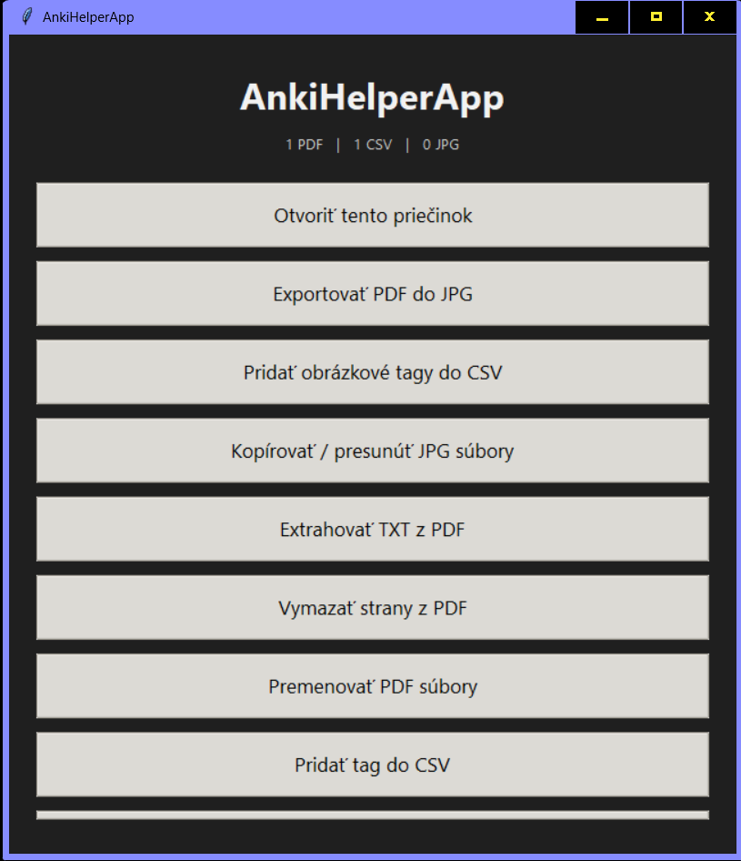
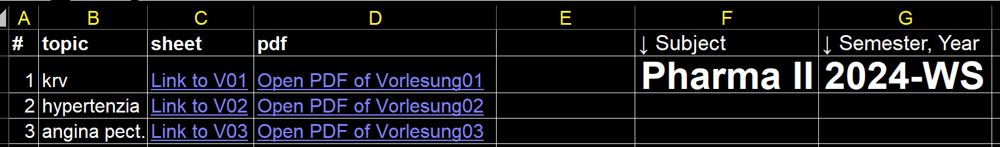
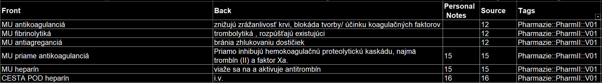

<a id="readme-top"></a>

<h3 align="center">Správa prednášok pre ANKI</h3>

<p align="center">
  
</p>

<p align="center">
  
</p>

<!-- TABLE OF CONTENTS -->
<details>
  <summary>Obsah</summary>
  <ol>
    <li><a href="#about-the-project">O projekte</a></li>
    <ul>
      <li><a href="#prerequisites">Požiadavky</a></li>
    </ul>
    <li><a href="#usage">Použitie</a></li>
    <li><a href="#excel">Excel šablóna</a></li>
    <li><a href="#roadmap">Postup</a></li>
    <li><a href="#additional-notes">Ďalšie poznámky</a></li>
    <li><a href="#contact">Kontakt</a></li>
  </ol>
</details>

<!-- ABOUT THE PROJECT -->
<a id="about-the-project"></a>

## O projekte

Tento nástroj zjednodušuje prípravu prednášok, cvičení a knižných materiálov do ANKI. Spracuje PDF a tabuľky (XLSX, CSV, TSV) tak, aby sa z nich dali rýchlo spraviť ANKI karty s obrázkami slajdov.

Aplikácia obsahuje tieto funkcie:

- [1] Otvorenie priečinka s aplikáciou.
- [2] Export PDF strán do JPG obrázkov.
- [3] Pridanie HTML tagov pre obrázky (výstup TSV pre Anki).
- [4] Kopírovanie alebo presun obrázkov (napr. do `collection.media`).
- [5] Extrakcia TXT textu z PDF.
- [6] Vymazanie vybraných strán z PDF.
- [7] Premenovanie PDF súborov.
- [8] Pridanie tagu (výstup TSV).
- [9] Oprava stĺpca Back pre ANKI import.

### Riešenie

Celý workflow je postavený na jednoduchej myšlienke:

- prednášky a cvičenia sú uložené ako PDF,
- PDF sa rozdelí na obrázky,
- v Exceli sa ku kartám zapíšu čísla strán,
- z čísel strán vzniknú HTML odkazy na obrázky (v Exceli vzorcom alebo v aplikácii),
- výsledné TSV sa importuje do ANKI.

Používa sa:

- ANKING notetype,
- TSV import do ANKI s file headers (`#separator`, `#html`, `#columns`, `#tags column`),
- HTML odkazy na obrázky uložené v ANKI media priečinku,
- Excel ako hlavný manažér poznámok.

### Vylepšenia

Excel slúži ako hlavný prehľad prednášok a poznámok. V jednom súbore sa dajú držať odkazy na prednášky, jednotlivé témy, tagy a výstupy pre ANKI.

<p align="center">
  
</p>

Každá téma môže mať vlastný list. Z hlavného listu sa dá prekliknúť priamo na konkrétnu prednášku alebo tému. Tagy sa dajú filtrovať a pripraviť na export do ANKI.

<p align="left">(<a href="#additional-notes">podrobnejšie informácie v časti Ďalšie poznámky</a>)</p>

<p align="left">(<a href="#readme-top">späť na začiatok</a>)</p>

<!-- GETTING STARTED -->
<a id="prerequisites"></a>

### Požiadavky

Potrebujete:

- Windows a Python 3.10+ (pri inštalácii zaškrtnúť „Add to PATH“),
- Excel alebo iný tabuľkový editor,
- ANKI 2.1.54 alebo novšie (kvôli TSV hlavičkám),
- ANKING notetype,
- PDF súbory s prednáškami alebo cvičeniami.

Knižnice (PyMuPDF, Pillow, openpyxl) doinštaluje `START.bat` sám.

Excelová šablóna (`Excel_sablona.xlsx`) je pripravená pre ANKING notetype, viď https://github.com/AnKing-VIP/AnKing-Note-Types

Tu je vzor, ako má vyzerať príprava dát v Exceli:

<p align="center">
  
</p>

Do príslušných stĺpcov sa zapisujú čísla strán alebo slajdov. Z nich potom vzniknú HTML odkazy na obrázky pre ANKI.

<p align="left">(<a href="#readme-top">späť na začiatok</a>)</p>

<!-- USAGE EXAMPLES -->
<a id="usage"></a>

## Použitie

### Spustenie

**Dvojklik na `START.bat`** – pri prvom spustení doinštaluje knižnice a otvorí aplikáciu.

Ručne:

```bash
pip install -r requirements.txt
python anki_gui.py
```

Konzolová verzia: `python anki_app.py`. Testy: `pip install -r requirements-dev.txt` a `python -m pytest`.

Štruktúra:

```text
START.bat           spustenie jedným klikom
anki_gui.py         GUI (tkinter)
anki_app.py         konzolová verzia
core/               spoločná logika (tabuľky, strany, PDF, médiá)
Excel_sablona.xlsx  šablóna na poznámky so vzorcami pre  odkazy
tests/              pytest
```

Po spustení GUI si môžete vybrať jednu z týchto možností:

### [1] Otvoriť tento priečinok

Otvorí priečinok, v ktorom je aplikácia. Do tohto priečinka vložte PDF a tabuľky (XLSX, CSV, TSV), s ktorými chcete pracovať.

### [2] Exportovať PDF do JPG

Konvertuje stránky PDF do JPG obrázkov pre ANKI.

Pri prednáške alebo cvičení sa aplikácia opýta na:

- skratku predmetu,
- typ materiálu (cvičenie / prednáška),
- číslo prednášky alebo cvičenia.

Názvy súborov sa generujú podľa logiky:

```text
predmet_C/P_##_S_##.jpg
```

Vysvetlenie:

- `C` = cvičenie,
- `P` = prednáška,
- `S` = strana alebo slajd,
- `##` = číslo vo formáte 01, 02 … 99, 100, 101 … (vždy aspoň 2 cifry – export aj odkazy používajú rovnaké pravidlo).

Príklady:

```text
O-CHEM1_C_01_S_02.jpg
O-CHEM1_P_01_S_02.jpg
```

Obrázky sa uložia do priečinka pomenovaného podľa nich, napr. `jpg_O-CHEM1_C_01/`.

Ak vyberieš viac PDF naraz, aplikácia sa spýta na číslo pre každé PDF zvlášť a nepovolí dva rovnaké názvy (obrázky by sa prepísali).

Pre dokument, napríklad vypracovanie alebo knihu, sa použije názov PDF:

```text
pdf_name_S_##.jpg
```

Príklad pre PDF `Memorix.pdf`:

```text
Memorix_S_01.jpg
Memorix_S_02.jpg
```

Kvalita exportu: 300 DPI (slajd 16:9 ≈ 4000 px na šírku), JPG kvalita 100 bez chroma subsamplingu (4:4:4) – prakticky bezstratové. Nastavenie je v `core/__init__.py`. Export beží na pozadí s progress barom.

### [3] Pridať obrázkové tagy (CSV/TSV/XLSX)

Prepíše čísla strán vo vybraných stĺpcoch na HTML odkazy na obrázky.

Vstup:

- **XLSX priamo z Excelu** – aplikácia sa spýta na list (`3 ANKI ALL-LECTURES` ponúkne ako prvý). Čítajú sa hodnoty z posledného uloženia, takže súbor pred spracovaním ulož (Ctrl+S).
- **CSV** – čiarka aj stredník (slovenský Excel), oddeľovač sa zistí automaticky.
- **TSV** – aj výstup tejto aplikácie (dá sa reťaziť: obrázky → tagy → Back).

Výstup je vždy TSV (napr. `deck_images.tsv`) s Anki hlavičkami. Pôvodný súbor sa nemení.

```text
#separator:Tab
#html:true
#columns:Front	Back	Personal Notes	Source	Tags
#tags column:5
```

Vďaka tomu Anki pri importe samo nastaví oddeľovač, zapne HTML a priradí tagy.

Podporované zápisy v bunke: `12`, `1,2,10`, `1;2`, `5-7`, `1, 5-7`. Bunky s iným textom (napr. „pozri skriptá“) sa nemenia a aplikácia ich vypíše ako upozornenie. Bunky, ktoré už obsahujú ``, ostanú tak.

Podporované stĺpce:

- Source,
- Personal Notes,
- Extra,
- Missed Questions.

Príklad výsledného HTML odkazu (viac obrázkov sa spojí cez `<br>`):

```html

```

Veľkosť obrázka na karte určuje CSS notetypu. Ak sú obrázky príliš veľké, pridaj do Styling:

```css
img { max-width: 100%; height: auto; }
```

### [4] Kopírovať alebo presunúť obrázky

Skopíruje alebo presunie obrázky (JPG, PNG, WEBP, GIF) do cieľového priečinka.

Pred akciou aplikácia porovná súbory s cieľom:

- **nové** sa skopírujú,
- **rovnaké** sa preskočia,
- **rovnaké meno, iný obsah** – aplikácia ich vypíše a spýta sa, či ich prepísať.

Pre ANKI vyberte priečinok `collection.media` vášho profilu, typicky:

```text
C:\Users\<meno>\AppData\Roaming\Anki2\<profil>\collection.media
```

### [5] Extrahovať TXT z PDF

Extrahuje text z vybraného PDF súboru do TXT súboru (s oddeľovačmi strán alebo ako vyčistený text).

Toto je užitočné, keď chcete z prednášky rýchlo získať text a ďalej ho upravovať.

### [6] Vymazať strany z PDF

Vytvorí nový PDF súbor (`*_modified.pdf`) bez vybraných strán. Originál ostane nezmenený.

Príklad vstupu:

```text
1,3,5-7
```

Tým sa odstránia strany 1, 3, 5, 6 a 7.

### [7] Premenovať PDF súbory

Premenuje vybrané PDF súbory v priečinku aplikácie. Existujúci súbor sa neprepíše.

### [8] Pridať tag (CSV/TSV/XLSX)

Pridá zadaný tag do stĺpca Tags. Tag sa pridá iba tam, kde je bunka prázdna. Hierarchické tagy fungujú, napr. `Pharmazie::PharmII::V01`.

### [9] Opraviť stĺpec Back

Opraví formátovanie poľa Back pre ANKI HTML import – časti `O:`, `U:`, `I:`, `F:` (odstup, úpon, inervácia, funkcia) dá na samostatné riadky a zvýrazní tučne. Dá sa spustiť aj opakovane.

<p align="left">(<a href="#readme-top">späť na začiatok</a>)</p>

---

<a id="excel"></a>

## Excel šablóna

`Excel_sablona.xlsx` má tri listy:

| List | Obsah |
|---|---|
| `1 PREHĽAD` | Zoznam prednášok s odkazmi na listy a PDF, stĺpec **img base** (začiatok mena obrázkov, napr. `PharmII_P_01`), legenda |
| `V01` | Karty jednej prednášky: Front, Back, Personal Notes, Source, Tags. Do Personal Notes / Source sa píšu čísla slajdov |
| `3 ANKI ALL-LECTURES` | Počíta sa sám: preberie karty z `V01` a čísla slajdov prepíše vzorcom na `` |

Pravidlá pre vzorce v šablóne:

- viac slajdov v bunke oddeľ čiarkou, napr. `15,16` (najviac 4),
- rozsah `5-7` vzorec nevie – použi `5,6,7` alebo nechaj spracovať aplikáciu,
- text v bunke ostane textom,
- bunka nesmie začínať `=` (Excel z nej spraví vzorec) – ak treba, napíš pred ňu apostrof: `'= text`.

Tento list potom stačí uložiť a načítať v aplikácii (funkcia [3]), alebo uložiť ako CSV UTF-8 a importovať do ANKI.

### Odkazy v Exceli

Odkaz na iný list:

```excel
=HYPERLINK("#'nazov_listu'!A1", "text_na_zobrazenie")
```

Príklad:

```excel
=HYPERLINK("#'V01'!A1", "Link to V01")
```

Na presun medzi listami môžete používať `Ctrl + PgUp` a `Ctrl + PgDn`.

Odkaz na PDF prednášku (relatívna cesta funguje, keď je PDF v rovnakom priečinku ako xlsx):

```excel
=HYPERLINK("V PharmII01.pdf", "Open PDF of Vorlesung01")
=HYPERLINK("C:\Users\User1\Desktop\ANKI\Lecture01.pdf", "Otvoriť Lecture01")
```

<p align="left">(<a href="#readme-top">späť na začiatok</a>)</p>

<!-- ROADMAP -->
<a id="roadmap"></a>

## Postup

1. **Pripravte vstupné súbory**

   - Vložte PDF a Excel (XLSX) do priečinka aplikácie.
   - Do stĺpcov, ktoré majú obsahovať obrázky, napíšte čísla strán alebo slajdov.
   - Excel uložte (Ctrl+S).

2. **Spustite aplikáciu**

   - Dvojklik na `START.bat`.

3. **Spracujte súbory**

   - **[2]** PDF → JPG (zapamätajte si predmet, typ a číslo – musia sedieť s odkazmi).
   - **[3]** Excel → TSV s `` odkazmi (pri šablóne s list `3 ANKI ALL-LECTURES` sú odkazy už hotové, aplikácia ich len prenesie do TSV).
   - **[4]** Obrázky → `collection.media`.

4. **Importujte TSV do ANKI**

   - File → Import → vyberte `.tsv` súbor (oddeľovač, HTML a tagy sa nastavia samé).
   - Vyberte notetype (AnKing) a balíček, pri prvom importe skontrolujte mapovanie stĺpcov.
   - Importujte karty.

<p align="left">(<a href="#readme-top">späť na začiatok</a>)</p>

<!-- ADDITIONAL NOTES -->
<a id="additional-notes"></a>

## Ďalšie poznámky

### Príprava tabuľky pre HTML odkazy

V Exceli sa do stĺpcov ako Personal Notes, Source alebo Missed Questions zapisujú čísla strán.

Príklad:

```text
1,2,10,99
```

Z týchto čísel vzniknú HTML odkazy na obrázky:

```html
<br><br>…
```

### Čo sa nemení

Aplikácia nikdy neprepisuje vstupné súbory. Výstupy dostanú príponu `_images`, `_tagged`, `_fixed` alebo `_modified`.

### Zdroje inšpirácie

Kombinácia ANKING notetype, CSV/TSV importu a HTML odkazov na obrázky:

[1] **The AnKing Note Types and Add-on**  
https://www.youtube.com/watch?v=NYUhNMyAZNs  
https://github.com/AnKing-VIP/AnKing-Note-Types

[2] **Importing Flashcards Into Anki**  
https://www.youtube.com/watch?v=s0QQJp8HPd0

[3] **Stop copying and pasting images into your flashcards**  
https://www.youtube.com/watch?v=s0QQJp8HPd0 <!-- TODO: rovnaký link ako [2], doplniť správny -->

[4] **Anki manuál – Importing text files (file headers)**  
https://docs.ankiweb.net/importing/text-files.html

<p align="left">(<a href="#readme-top">späť na začiatok</a>)</p>

<!-- CONTACT -->
<a id="contact"></a>

## Kontakt

Pre otázky otvorte GitHub Issue v tomto repozitári.
